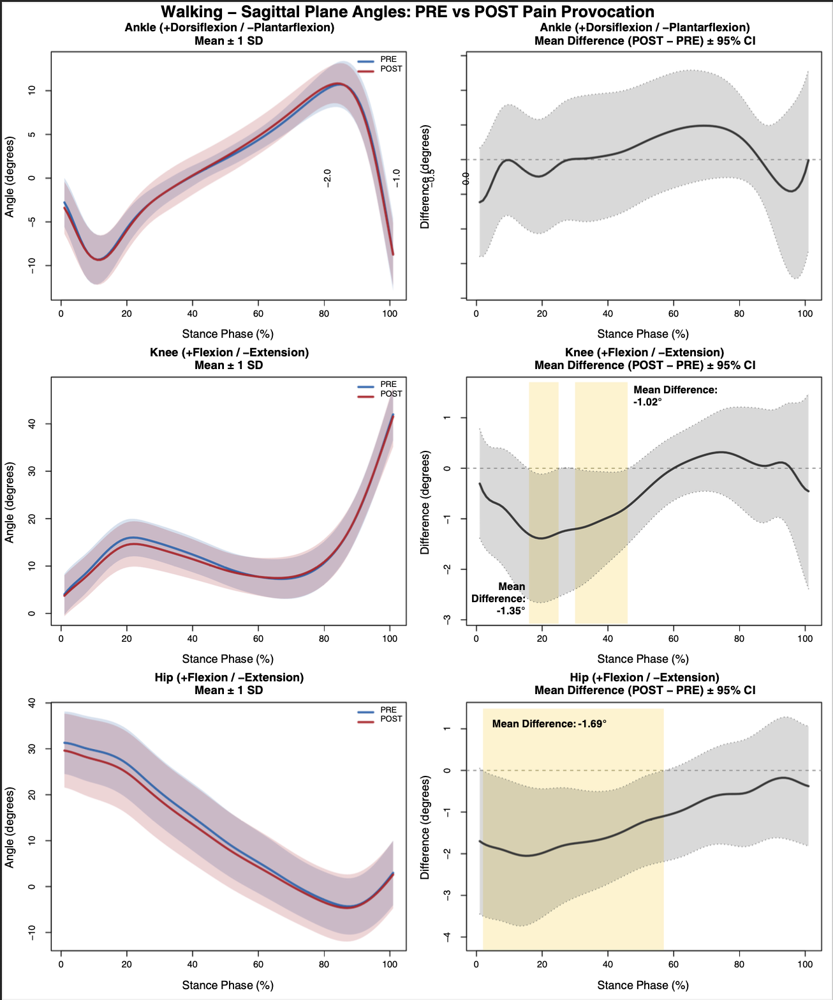

# functional_data_analysis

# Functional Data Analysis: Lower Extremity Kinematics

Functional data analysis (FDA) of lower extremity joint angles during walking and single leg squat tasks. Compares PRE vs POST pain provoking protocol conditions using B-spline smoothing with pointwise 95% confidence intervals to identify regions of significant difference across the movement cycle.

---

## Analyses

### Walking Kinematics
Analyzes ankle, knee, and hip angles in sagittal and frontal planes during the stance phase of walking.

[View Code](fda_walking_kinematics.R)

---

### Single Leg Squat Kinematics
Analyzes ankle, knee, and hip angles in sagittal and frontal planes during the single leg squat cycle.

[View Code](fda_sls_kinematics.R)

---

## Example Output
An example output from this code is provided below, this ouput can be created for any joint across any plane.

---

## Methods

| Parameter | Value |
|-----------|-------|
| Smoothing | B-spline basis (19 functions, order 4) |
| Lambda | 1e-4 |
| Comparison | Paired (POST – PRE) |
| Inference | Pointwise 95% CI |

Significant regions are identified where the confidence interval of the mean difference excludes zero.

---

## Contact

Timothy Gilgallon  
[GitHub](https://github.com/timgilgallon)
